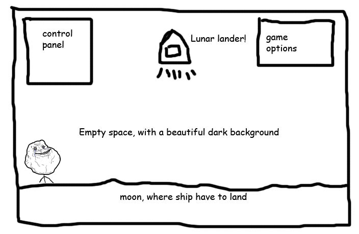

# LMSGI-02. Proyecto Lunar Landing (HTML y CSS)
#### Descripción de la práctica.
Para realizar el proyexto Lunar Landing se debe desarrollar la primera parte de una aplicación web según el siguiente _StoryBoard_:

El objetivo es crear una aplicación web similar (diversas páginas web: _.html, css_ y imágenes), documentando todo el proceso en el presente _README.md_.
#### Desarrollo de la práctica:
En primer lugar se han creado tres archivos de texto plano, modificando sus extensiones para que sean las tres páginas que serán enlazadas y servirán para la práctica. Las tres páginas son:
 * _inicio_html_. Que servirá como página principal y contendrá los elementos del futuro _Lunar Landing_.
 * _creditos.html_. Utilizaré está página para elacionar las web y lugares de donde se han obtenido las imágenes y el apoyo para la tarea. 
 * _intrucciones.html_. Se realizará una breve descripción del juego y sus controles.

Descripción de los elementos contenidas en el _html_ de la página de inicio:
 * _!DOCTYPE HTML_: Definición del tipo de documento.
 * _html_: Representa la raíz de un documento HTML o XHTML. Todos los demás elementos deben ser descendientes de este elemento.
 * _head_: Representa una colección de metadatos acerca del documento, incluyendo enlaces a, o definiciones de, scripts y hojas de estilo.
 * _link_: Se ha utilizado para enlazar las hojas de estilos CSS externas con el documento HTML actual. En este caso existen dos hojas diferentes en función del tamaño de pantalla del dispositivo. Si tiene 721px de ancho o más, gracias al atributo _media_ aplicará el contenido de la hoja _estilo.css_(Primer _link_), en caso de tener menos de 721px de ancho aplicaría la hoja _estilo m.css_. Con el atributo _href_ le indicamos la ruta hasta la hoja de estilos referenciada.
 * _title_ Define el título del documento, el cual se muestra en la barra de título del navegador o en las pestañas de página. Solamente puede contener texto y cualquier otra etiqueta contenida no será interpretada.
